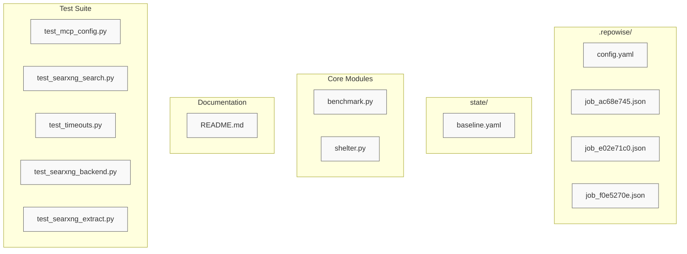

# Architecture Diagram: Agent-Ersatz

# Agent-Ersatz Architecture Overview

## Repository Summary
The `Agent-Ersatz` repository is structured as a modular testing, benchmarking, and configuration validation environment for agent workflows. The codebase emphasizes isolated test suites targeting SearXNG backends, MCP configurations, timeout handling, and state management. The design prioritizes decoupled execution paths with no internal runtime dependencies between core modules.

## Architecture Diagram

## Component Breakdown (Communities)
The repository is organized into 9 functional communities based on cohesion and PageRank analysis:

- **Community 0 (Documentation):** `README.md`
- **Community 1 (Benchmarking):** `benchmark.py`
- **Community 2 (Core Logic):** `shelter.py`
- **Community 3 (Repowise Config):** `.repowise/config.yaml`
- **Community 4 (Job Definition A):** `.repowise/jobs/ac68e745-3c4b-475b-ba4a-3a86ba7a405f.json`
- **Community 5 (Job Definition B):** `.repowise/jobs/e02e71c0-9c9f-4fa5-b394-b924891b6d5e.json`
- **Community 6 (Job Definition C):** `.repowise/jobs/f0e5270e-26df-4f3d-ba57-8f0aba41f5d6.json`
- **Community 7 (State Config):** `state/baseline.yaml`
- **Community 8 (Testing Suite):** `tests/test_mcp_config.py`, `tests/test_searxng_search.py`, `tests/test_timeouts.py`, `tests/test_searxng_backend.py`, `tests/test_searxng_extract.py`

## Dependency Analysis
- **Total Edges:** 0
- **Cycles / Strongly Connected Components:** None detected
- The architecture exhibits a flat, dependency-free topology. Each component operates independently, indicating a design optimized for isolated testing, configuration validation, and stateless benchmarking. Cross-module imports are intentionally avoided; external dependencies are likely resolved at the runtime or CI/CD level rather than through intra-repository coupling.

## Notes & Observations
- All 14 files represent the complete PageRank top list for this repository.
- The absence of internal edges confirms a highly decoupled, test-driven structure typical of configuration-heavy tooling and backend validation suites.
- Full per-file module coverage can be generated using dedicated module pages if deeper intra-module or runtime dependencies require analysis.